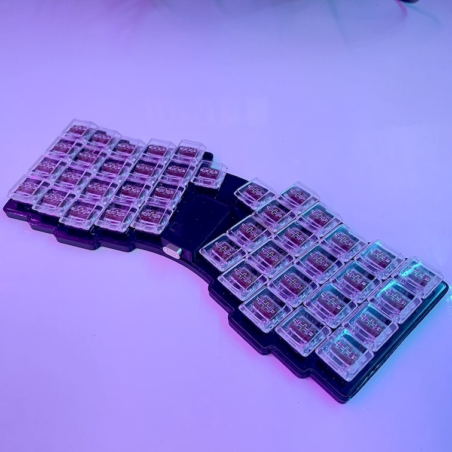
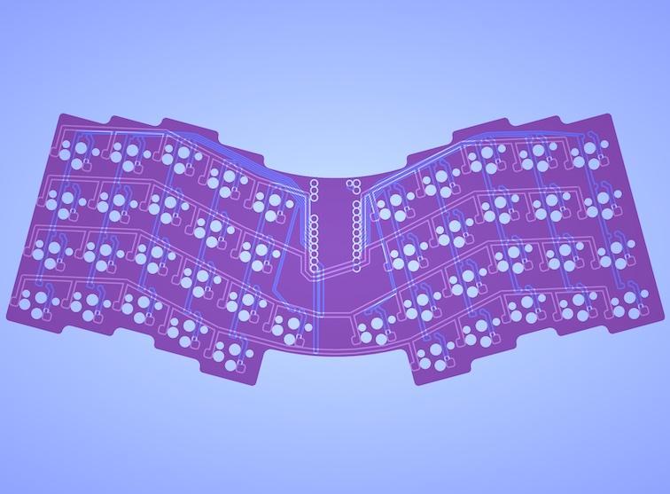
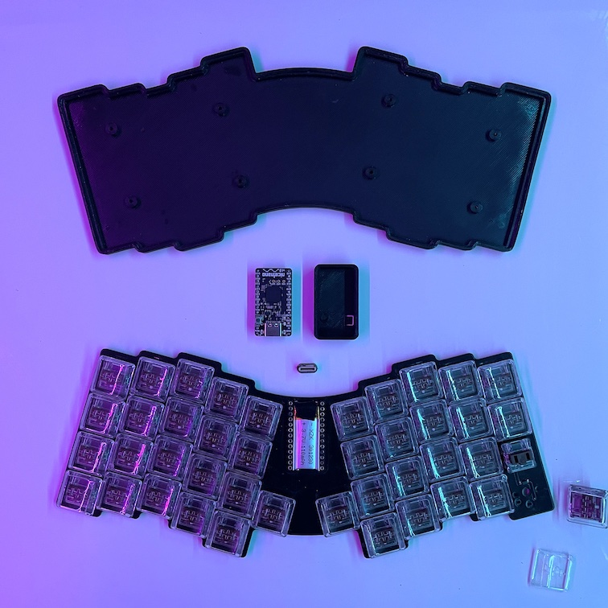
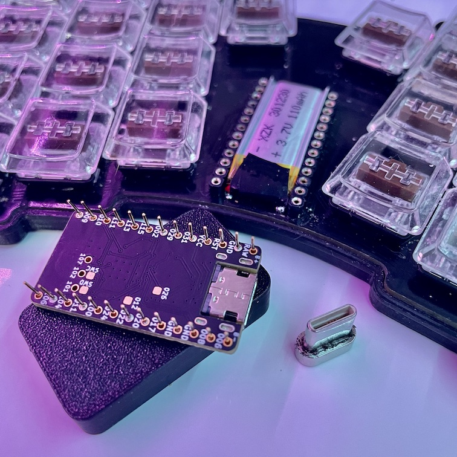

# Batreus44

### Description
A keyboard with 42 keys based on the [Atreus](https://atreus.technomancy.us) layout updated by [keyboard.io](https://shop.keyboard.io/collections/keyboardio-atreus/products/keyboardio-atreus) to 44 keys. Uses [Kailh Choc](http://www.kailh.com/en/Products/Ks/CS/) low profile switches with hot-swap sockets. The key positions have been adjusted to the 18x17mm recommended spacing.  Compatible with ProMicro type controllers, but designed to be used with [Nice!Nano](https://nicekeyboards.com/nice-nano). Also Compatible with BlueMicro840/833 as well as other controllers that uses the footprint of the Pro Micro. Note that the batttery + gets connected to Raw.  Capable of n-key rollover.

### Build
There is gerber files for the PCB gerber folder.

It uses **3mm tall machine pin headers** to create space for **301230 battery**. The holes in the PCB are enlarged to allow the headers to sit flush with the board.

For every switch there is a **1N4148** diode in a **SOD123** package. Diodes are soldered where an LED would normally be located, as the board has no lighting of any sort. Although can diodes be soldered by hand, a hot-air gun definitely makes task easier.

I've attached some rubber feet as well to keep it from sliding around.

Few things to note:
- There is a battery disconnect switch and a reset switch under the PCB.
- Although many controllers are shipped with included pin headers, they are not to be used on this board.

### Images from the Batreus42 from levitatingpineapple.

